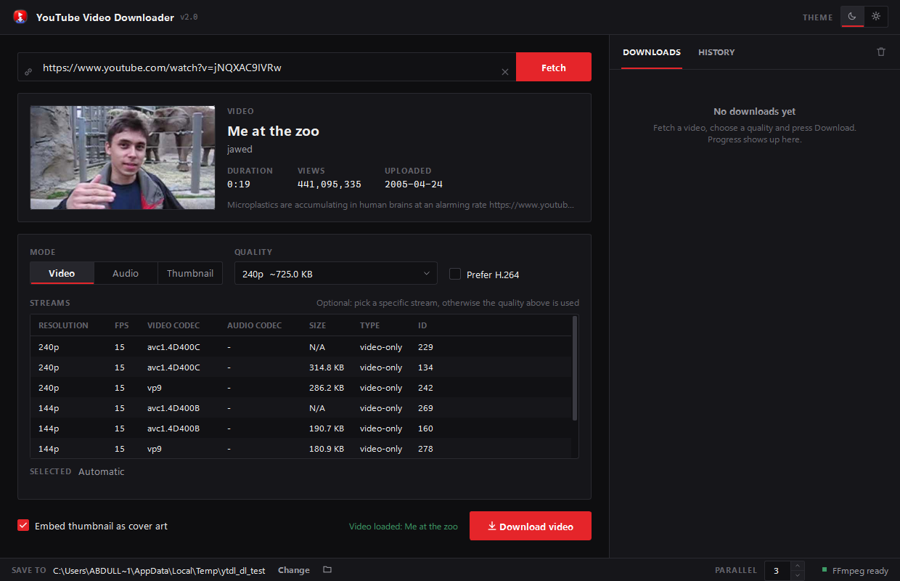
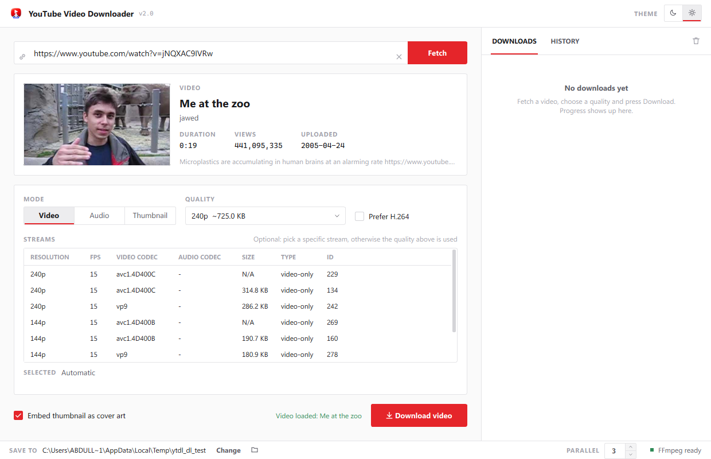

# YouTube Video Downloader

[](https://github.com/Abdullah-Masood-05/YT-VideoDowloader/actions/workflows/build-windows.yml)
[](https://github.com/Abdullah-Masood-05/YT-VideoDowloader/actions/workflows/build-linux.yml)
[](https://github.com/Abdullah-Masood-05/YT-VideoDowloader/actions/workflows/build-macos.yml)

A desktop app for Windows, Linux and macOS for downloading YouTube videos, audio and thumbnails, built on
[yt-dlp](https://github.com/yt-dlp/yt-dlp) and PyQt6.



## Features

- Quality list built from what each video actually offers (no fake 4K options)
- Video (MP4, optional H.264 for compatibility), audio (MP3, M4A, OPUS, WAV, FLAC) and thumbnail modes
- Embedded cover art and metadata
- Parallel downloads with progress, speed and ETA; download history
- Saves to your Downloads folder by default
- Dark theme by default, with a light theme switch



## Install

Download from [Releases](https://github.com/Abdullah-Masood-05/YT-VideoDowloader/releases).
FFmpeg is bundled on every platform.

| Platform | File |
|---|---|
| Windows 10/11 x64 | `YouTubeVideoDownloader-Setup-<version>.exe` (or the standalone `.exe`) |
| Debian / Ubuntu | `youtube-video-downloader_<version>_amd64.deb` (`sudo apt install ./<file>.deb`) |
| Fedora / openSUSE | `youtube-video-downloader-<version>-1.x86_64.rpm` (`sudo dnf install ./<file>.rpm`) |
| Arch Linux | `youtube-video-downloader-<version>-1-x86_64.pkg.tar.zst` (`sudo pacman -U <file>`) |
| macOS 11+ (Apple Silicon) | `YouTubeVideoDownloader-<version>-macos-arm64.dmg` (experimental) |

The builds are not code-signed. On Windows, SmartScreen may warn. On macOS, right-click the app
and choose **Open** the first time, or run
`xattr -dr com.apple.quarantine "/Applications/YouTube Video Downloader.app"`.

## Development

Requires [uv](https://docs.astral.sh/uv/) and Python 3.12.

```sh
uv sync
uv run main.py
```

When running from source the app looks for `ffmpeg.exe` / `ffprobe.exe` in `ffmpeg\`,
then on `PATH`. The bundled binaries are a minimal LGPL build of FFmpeg 7.1.1
containing only what yt-dlp needs here (merging, audio conversion, thumbnail embedding).

## Building

Requires MSVC (Visual Studio Build Tools) and [Inno Setup 6](https://jrsoftware.org/isinfo.php).

```bat
uv sync
build.bat
```

This compiles a single-file exe with Nuitka into `build_dist\` and the installer into
`installer_output\`. Notes on the build flags are in `build.bat` and
[docs/NUITKA_BUILD_NOTES.md](docs/NUITKA_BUILD_NOTES.md).

CI builds every platform on each push to `main`, and pushing a `v*` tag attaches all
installers and packages to the GitHub release:

- Windows: Nuitka onefile exe + Inno Setup installer (`.github/workflows/build-windows.yml`)
- Linux: Nuitka standalone build packaged as .deb, .rpm and .pkg.tar.zst, each installed and
  launched in its own distro container (`packaging/linux/`)
- macOS: PyInstaller app bundle in a DMG, because Nuitka does not support PyQt6 on macOS
  (`packaging/macos/`)

FFmpeg comes from [ffmpeg-ytdl-minimal-build](https://github.com/Abdullah-Masood-05/ffmpeg-ytdl-minimal-build).

## Project layout

```
main.py              main window
theme.py             dark / light themes
app_paths.py         paths for source and compiled builds
config_manager.py    settings in %APPDATA%\YouTubeVideoDownloader
download_manager.py  download queue
widgets/             UI components
workers/             fetch and download threads
resources/icons/     app icon
installer.iss        Inno Setup script
packaging/           Linux and macOS packaging
.github/workflows/   CI for Windows, Linux and macOS
```

## License

FFmpeg is licensed under LGPL-2.1-or-later; the bundled build also links LAME (LGPL)
and libopus (BSD).
